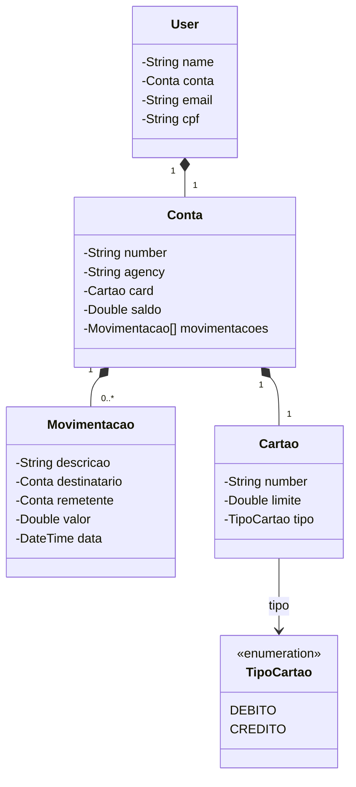

# Semana Nacional da Tecnologia Java API Rest

REST API da Semana Nacional da Tecnologia em Java 17 com Spring Boot 3.

## Principais Tecnologias
 - **Java 17**: Utilizaremos a versão LTS mais recente do Java para tirar vantagem das últimas inovações que essa linguagem robusta e amplamente utilizada oferece;
 - **Spring Boot 3**: Trabalharemos com a mais nova versão do Spring Boot, que maximiza a produtividade do desenvolvedor por meio de sua poderosa premissa de autoconfiguração;
 - **Spring Data JPA**: Exploraremos como essa ferramenta pode simplificar nossa camada de acesso aos dados, facilitando a integração com bancos de dados SQL;
 - **Lombok**: Aumentaremos nossa produtividade com a ajuda dessa biblioteca que nos permite escrever menos código, reduzindo a verbosidade e a repetição;
 - **OpenAPI (Swagger)**: Vamos criar uma documentação de API eficaz e fácil de entender usando a OpenAPI (Swagger), perfeitamente alinhada com a alta produtividade que o Spring Boot oferece;
 - **JUnit 5**: Aprenderemos a escrever testes automatizados eficazes e eficientes com a ajuda do JUnit 5, a versão mais recente e poderosa do popular framework de testes para Java;
 - **Render**: facilita o deploy e monitoramento de nossas soluções na nuvem, além de oferecer diversos bancos de dados como serviço e pipelines de CI/CD.

## Diagrama de Classes (Domínio da API)

## Documentação da API (Swagger)

